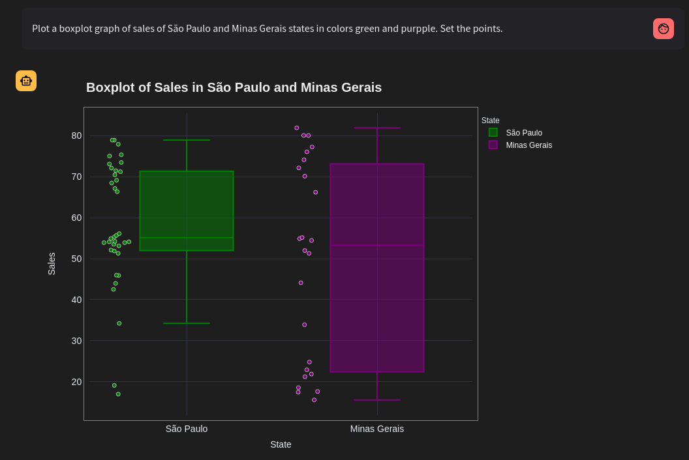

<br/>

# AI-Datanalysis

<br/>

**AI-Datanalysis** is a chatbot tool powered by AI agent for analyzing and discovering knowledge in data. 

This project aims to facilitate data interpretation and manipulation, allowing users to ask questions in natural language and receive insights directly from their data through graphs, tables, texts or even maps. 
The application's brain is heavily based on generative models (LLMs) integrated with powerful framework solutions such as: **Plotly** (graphics engine), **Langchain** (LLM interface), **Statsmodels** and **Scipy** (statistics), **Pandas** (dataframe), **Numpy** (mathematics), **Streamlit** (web interface), **Scikit-learn** (Machine Learning), in addition to the possibility of including other modules in the execution environment.

<br/>

<h3 align="center">
  
</h3><br/>

## Prerequisites

- [Docker](https://docs.docker.com/get-docker/)
- [Docker Compose](https://docs.docker.com/compose/install/)
- [Git](https://git-scm.com/book/en/v2/Getting-Started-Installing-Git)
- [Poetry](https://python-poetry.org/)
- [Python &gt;= 3.11](https://www.python.org/downloads/)
- Ambiente Linux | Windows

<br/>

## Get started

### Installation

#### Option-1 Docker (recommended):

```
git clone https://github.com/fab2112/AI-Datanalysis.git
cd AI-Datanalysis
```

```
docker-compose up --build -d
```

#### Option-2 Poetry:

```
git clone https://github.com/fab2112/AI-Datanalysis.git
cd AI-Datanalysis
```

```
poetry shell
poetry install

streamlit run app.py 
```

<br/>

## Usage

After installation access the app in the browser using the [http://0.0.0.0:8501](http://0.0.0.0:8501) or [http://localhost:8501](http://localhost:8501)

### Load dataset

<h3 align="left">
  
</h3>

### Set language and privacy

- **Anonymous** privacy only metadata is sent to the model

<h3 align="left">
  
</h3>

### Set model and api-key

<h3 align="left">
  
</h3>

### For local model (Ollama)

<h3 align="left">
  
</h3>

### For maps in Plotly with Mapbox

- **Mapbox API Token**  [Mapbox token](https://account.mapbox.com/access-tokens/)

<h3 align="left">
  
</h3>

### Add new modules to environment

- For adding new modules to environment execution set WHITELIST_ENV in app.py

```python
WHITELIST_ENV = ["json", "statsmodels", "scipy", "datetime"]
```

<br/>

## LLMs available

|        | Model                   | Api-Key URL                                            |
| ------ | ----------------------- | ------------------------------------------------------ |
| Groq   | llama3-70b-8192         | [Groq Cloud](https://console.groq.com/keys)               |
| Groq   | mixtral-8x7b-32768      | [Groq Cloud](https://console.groq.com/keys)               |
| Google | gemini-1.5-pro-latest   | [Google AIStudio](https://aistudio.google.com/app/apikey) |
| Google | gemini-1.5-flash-latest | [Google AIStudio](https://aistudio.google.com/app/apikey) |
| OpenAI | gpt-3.5-turbo           | [OpenAI API](https://platform.openai.com/api-keys)        |
| Cohere | command-r-plus          | [Cohere API](https://dashboard.cohere.com/api-keys)       |

<br/>

## Ecosystem

- Infrastructure

| Component      | Version  |
| -------------- | -------- |
| Docker Engine  | 20.10.0+ |
| Docker Compose | 1.29.0+  |

- Applications

| Poetry | Python  |
| ------ | ------- |
| 1.8.3  | >= 3.11 |

<br/>

## Experiments - screenshots

- Density maps analysis 

<h3 align="center">
  
</h3><br />

- Scatter maps analysis 

<h3 align="center">
  
</h3><br />

- Choropleth maps 

<h3 align="center">
  
</h3><br />

- Scatter 3d analysis

<h3 align="center">
  
</h3><br />

- OHLC data analysis

<h3 align="center">
  
</h3><br />

- Bar plot analysis

<h3 align="center">
  
</h3><br />

- Heatmap correlations

<h3 align="center">
  
</h3><br />

<h3 align="center">
  
</h3><br />

- Surfaces analysis

<h3 align="center">
  
</h3><br />

- Landscape analysis

<h3 align="center">
  
</h3><br />

- Pie plots analysis

<h3 align="center">
  
</h3><br />

- Box-plot and Violin-plot 

<h3 align="center">
  
</h3><br />

<h3 align="center">
  
</h3><br />

- Polar plots analysis 

<h3 align="center">
  
</h3><br />

<h3 align="center">
  
</h3><br />

- Machine Learning

<h3 align="center">
  
</h3><br />

<h3 align="center">
  
</h3><br />

- Manifold analysis

<h3 align="center">
  
</h3><br />

<h3 align="center">
  
</h3><br />

- Line and Area plots

<h3 align="center">
  
</h3><br />

- Scatter plots

<h3 align="center">
  
</h3><br />

<h3 align="center">
  
</h3><br />

## Experiments reproducibility

- Datasets and prompts available in the **datasets** directory


| Datasets            | 
| ------------------- | 
| cancer_data.csv     |
| everest_data.csv    | 
| sales_data.csv      |
| digits.csv          |
| iris.csv            |
| ohlcv.csv           |
| geojson_brasil.json |

<br />

## License

[MIT](https://choosealicense.com/licenses/mit/)

<br/>
